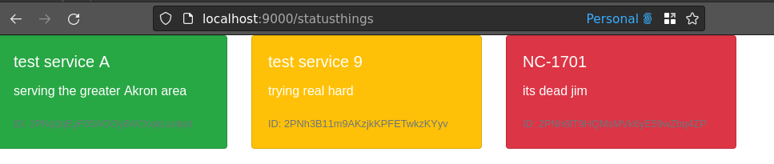

# statusthing
StatusThing is a super light and basic status site backend with optional simple dashboard

A statusthing item looks like so:

```json
{"id":"2PFmdOK9DiIwASE4ebfZZXzB7Mz","name":"test service 3","description":"my new service","status":"STATUS_YELLOW"}
```

- `id`: the unique id of the thing. this is generated automatically
- `name`: the name of the thing. this is not a multitenant system. name must be unique
- `description` the description of the thing. This can be used as a friendly description or a last update message - it's up to you
- `status`
    - `STATUS_GREEN`: generally maps to a healthy state
    - `STATUS_RED`: generally maps to an unhealth state
    - `STATUS_YELLOW`: maps to whatever intermediate state between healthy and unhealthy means to you

## Running
_note that the debug env var isn't required but the app is mostly silent otherwise except in cases of errors_

- `go build -o statusthing ./cmd/statusthing/main.go && STATUSTHING_DEBUG=1 ./statusthing`
- `STATUSTHING_DEBUG=1 go run ./cmd/statusthing/main.go`

## Configuration
Config is done through environment variables with a prefix of `STATUSTHING_`:

- `STATUSTHING_ADDR`: the ip:port string to listen on. defaults to `:9000`
- `STATUSTHING_DEBUG` regardless of value, if this is set debug logging will activate
- `STATUSTHING_BASEPATH` the basepath is path for requests. if not specified, the default is `/statusthings` and `/statusthings/api` for dashboard and api respectively
- `STATUSTHING_DBFILE` the sqlite file to use for data
- `STATUSTHING_APIKEY` if provided, password protects the api with the provided value and said value must be provided as an http header `X-STATUSTHING-KEY` for any requests

Additionaly, per the top-level README, setting `NGROK_AUTHTOKEN` will stand up a temporary ngrok endpoint for the app and specifiying `NGROK_ENDPOINT` will use that endpoint to expose it.
When exposed via ngrok the basepath and apikey settings are all honored as well.

## Dashboard

> Graphic design is my passion - someone on the internet

The dashboard is served off the root of the basepath. It is read-only and does not require authentication. Api calls still require an apikey if configured as such



## APIs
All `PUT`/`POST` requests must set the `Content-Type` header to `application/json`

### Get all statusthings
- `GET <basepath>/api/`: returns an array of statusthings:
    - sample response body
    ```json
    [
    {"id":"2PFmFIufOF9xAUL1ej6PnuLmMXr","name":"test service 2","description":"my new service 2","status":"STATUS_RED"},
    {"id":"2PFmUgm2Kqn9lxcJTHmRl9ux2gv","name":"test service 1","description":"my new service 1","status":"STATUS_GREEN"},
    {"id":"2PFmdOK9DiIwASE4ebfZZXzB7Mz","name":"test service 3","description":"my new service","status":"STATUS_YELLOW"}
    ]
    ```

### Get a specific statusthing
- `GET <basepath>/api/<id>`

    Gets the thing with the provided id

    - sample response body
    ```json
    {"id":"2PFmdOK9DiIwASE4ebfZZXzB7Mz","name":"test service 3","description":"my new service","status":"STATUS_YELLOW"}
    ```
    

### Add a new statusthing
- `PUT <basepath>/api/`

    Creates a new thing

    - sample request body
    ```json
    {"name":"thing name","description":"thing description","status":"valid status string"}
    ```

    - sample response body

    ```json
    {"id":"<generated id>","name":"thing name","description":"thing description","status":"valid status string"}
    ```

### Update an existing statusthing
- `POST <basepath>/api/<id>`

    Updates the thing with having id with the new values. Currently only `status` is supported

    - sample request body
    ```json
    {"status":"STATUS_GREEN"}
    ```

    Returns http status code `202` on success

### Delete a statusthing
- `DELETE <basepath>/api/<id>`
    
    Deletes the thing having the provided id

    Returns http status code `202` on success along with the final state of the deleted thing:
    ```json
    {"id":"2PFmdOK9DiIwASE4ebfZZXzB7Mz","name":"test service 3","description":"my new service","status":"STATUS_RED"}
    ```